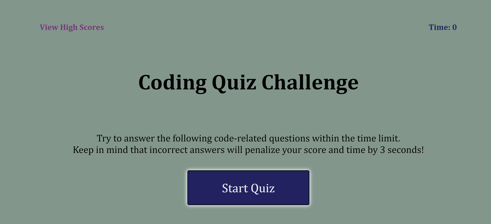

# The Wonderful Whimsical Code Quiz

## Description

This particular Jvascript Quiz has been created to showcase the use of DOM manipulation with Javascript. There will be a timed and graded quiz with the a local high score log. For each chosen correct answer, you will move on. For each chosen incorrect answer, you will be deducted 3 seconds from your time. Your score is the number of seconds in time you have left after the quiz is over! If you fail to complete the quiz, you lose. 

At the end when you log your initials, your high score will be stored so you can replay the game over again and try to beat it!

## Installation

N/A

## Technologies 

N/A

## Usage

This interactive JavaScript quiz is technically [ ;) ] for anybody.

There will be future developments to this application, we just aren't quite there yet. But rest assure, it is doing what it needs to at the moment :).

## Deployment

Live URL: <a href = "https://blairrrrwho.github.io/the-wonderful-whimsical-code-quiz/">
The Wonderful Whimsical Code Quiz</a>

## Credits

This lovely, lovely JavaScript Quiz was created with the assistance of fellow classmates: BRANDON JOHNSON, CHRISTINA HALL, and LACEY ANGARITA. And, as the all-caps intends, they are very important to me and I am happy to have had them here for this app's development. I couldn't have done it without their support. 

I also want to accredit a tutoring session with Ms. Sandy and also with Mr. Kumar.
Let's also shout out the Net Ninja from YouTube, Ask BCS, and all of the other lovely resources we were given through this process. 

Thank you all! 

It's been a long time coming, and I'm glad to have had these resources to make it through. 

## License

None
